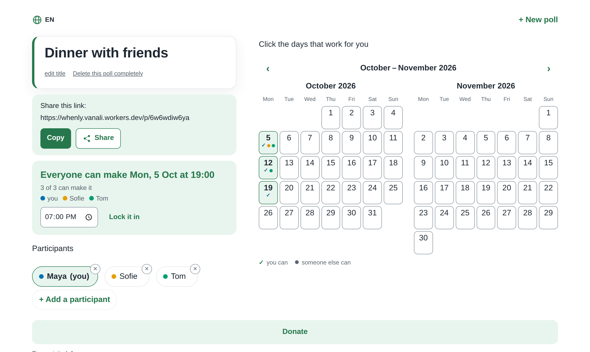

# Whenly

**Pick a date with a group. No account, no ads, free.** → **[whenly.vanali.workers.dev](https://whenly.vanali.workers.dev)**

Type what it's about and your name, and you're on the poll page with an open calendar. Tap the days that work for you. Share the link; whoever opens it types their name and taps along. As soon as everyone can make a day, it says so at the top in green. Nobody needs an account, not even the person who creates the poll.



- **No sign-up, no e-mail, no password.** A link is all a group needs.
- **One tap per day**, saved instantly. No save button, no confirmation dialogs.
- **Everyone is equal.** Anyone with the link can tap days, change the title and lock in the date. There is nothing only "the organiser" can do.
- **23 languages**, picked from your browser and switchable with the globe button: English, Dutch, French, German, Spanish, Portuguese, Polish, Ukrainian, Russian, Turkish, Arabic, Urdu, Hindi, Bengali, Indonesian, Vietnamese, Chinese, Japanese, Korean, Swahili, Tamazight (Tifinagh), Kurdish and Shona. Right-to-left for Arabic and Urdu; week start and 12/24-hour clock per locale. The FAQ and privacy page follow the same language.
- **Light.** One HTML file, no framework, no build step, no external scripts or fonts. Works on slow connections and installs as a PWA without an app store.
- **Your data stays yours.** Only the title, names and tapped days are stored. Anyone with the link can delete a poll completely; untouched polls are removed after 12 months. See [/privacy](https://whenly.vanali.workers.dev/privacy).
- **Open source (MIT)** on Cloudflare Workers + D1; fits in Cloudflare's free plan.

Questions or bugs: [open an issue](https://github.com/boulbaal/whenly/issues).

---

*Nederlands hieronder.*

**Een datum prikken met vrienden, zonder gedoe.** Typ waarover het gaat en je naam, en je staat op de afsprakenpagina met een open kalender. Dagen die lukken klik je gewoon aan. Deel de link; wie hem opent geeft eerst zijn naam en klikt dan mee. Zodra er een datum uitspringt, staat er bovenaan in het groen: *"Iedereen kan op ..."*

Geen accounts. Geen wachtwoorden. Geen beheerder. Geen opslaan-knop. Iedereen met de link kan precies hetzelfde.

## Waarom dit fijn werkt

- **Het gaat vanzelf** — een klik op een kalenderdag is meteen opgeslagen; er is geen opslaan-knop en geen enkel bevestigingsvenster. Een uur erbij zetten is optioneel en verschijnt pas bij de datum die eruit springt.
- **Iedereen ziet zijn naam, in kleur** — elke deelnemer krijgt een vaste kleur. Op de kalender staat een vinkje in jouw kleur bij je eigen dagen en een gekleurd stipje per andere persoon die kan.
- **Iedereen is gelijk** — wie de link heeft kan dagen aanklikken, de titel aanpassen, het uur wijzigen en de knoop doorhakken. Er is niets dat alleen "de maker" kan.
- **Je naam is je identiteit** — dezelfde naam op een ander toestel geeft je je eigen vinkjes terug. Via "Lid toevoegen" vul je de dagen in van iemand die ze je al doorgaf, zonder je eigen naam te verliezen.
- **Jij beslist over je gegevens** — iedereen met de link kan een naam weghalen (de groep ziet dan 30 dagen wie dat deed, niet de app) of de afspraak volledig verwijderen. Afspraken zonder activiteit verdwijnen na 12 maanden.
- **23 talen** (o.a. Nederlands, Engels, Frans, Arabisch, Hindi, Chinees, Russisch, Tamazight, Koerdisch, Shona), automatisch op basis van je browser, wisselbaar via de wereldbol, zonder herladen. Rechts-naar-links voor Arabisch en Urdu, weekstart en tijdnotatie per land. FAQ en privacypagina in dezelfde 23 talen.
- **Licht en gratis** — één HTML-bestand, één Worker, één SQLite-database (Cloudflare D1). Geen frameworks, geen build-stap, geen externe scripts of fonts. Past ruim binnen het gratis plan van Cloudflare.

## Techniek

| Onderdeel | Keuze |
|---|---|
| Hosting | Cloudflare Workers (gratis plan) met Static Assets |
| Opslag | Cloudflare D1 (SQLite) |
| Frontend | Eén `public/index.html`, inline CSS + JS, systeemfonts (enkel Tifinagh meegeleverd) |
| Backend | Eén `src/worker.js` (ES-module Worker): `/api/*`, taalpagina's, dagelijkse opruiming |
| Testen | Playwright: 20 API-testen, 21 browserscenario's en 5 statische controles, elk op desktop en op 360 px |

## Testen draaien

```
npm install
npm test
```

`npm test` zet zelf de lokale database op en start `wrangler dev`. De testen draaien twee keer: op desktop en op een viewport van 360×740.

---

# Whenly online zetten (eenmalig, ±10 minuten, gratis)

Nodig: een computer met Node 18+ en een gratis Cloudflare-account (cloudflare.com → Sign up).

1. Open een terminal in deze map en installeer wrangler:

       npm install

2. Meld je aan bij Cloudflare (opent de browser):

       npx wrangler login

3. Maak de database:

       npx wrangler d1 create prikdatum

   Kopieer de regel `database_id = "…"` uit de uitvoer naar `wrangler.toml`
   (vervang VUL-IN-NA-STAP-3).

4. Maak de tabellen:

       npm run db:remote

   Bestaande database van vóór de levenscyclus-update? Draai dan ook `npm run db:migrate`.

5. Zet online (commit eerst, het commitnummer wordt de versie):

       git commit -am "..."
       npm run deploy

   Onderaan staat je adres: `https://whenly.<jouw-naam>.workers.dev`

Klaar. Deel dat adres. Iedereen die het opent kan een afspraak maken.

Later iets aanpassen? Wijzig de bestanden, commit, en doe opnieuw `npm run deploy`.
Het script `tools/deploy.mjs` stempelt het korte commitnummer in de app, de API
en de service worker (map `dist/`), zodat de versie in de voettekst, `/api/version`
en de update-melding altijd kloppen.

Eigen domein? In het Cloudflare-dashboard: Workers & Pages → whenly → Settings → Domains & Routes.

## Licentie

MIT — doe ermee wat je wilt.
