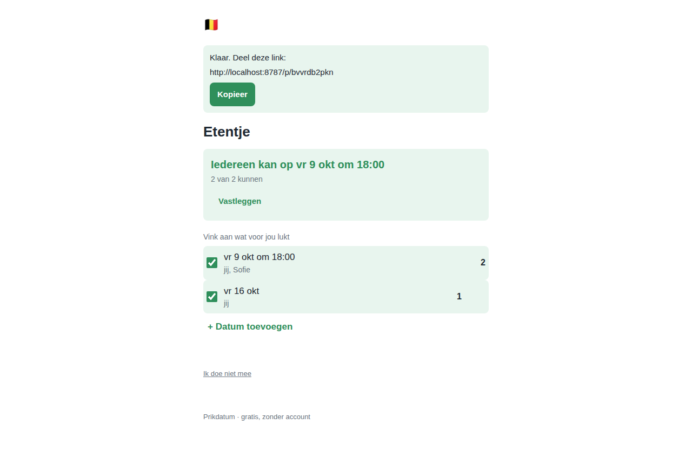

# Whenly

**Probeer het live: [whenly.vanali.workers.dev](https://whenly.vanali.workers.dev)**

**Een datum prikken met vrienden, zonder gedoe.** Typ waarover het gaat en je naam, en je staat op de afsprakenpagina met een open kalender. Dagen die lukken klik je gewoon aan. Deel de link; wie hem opent geeft eerst zijn naam en klikt dan mee. Zodra er een datum uitspringt, staat er bovenaan in het groen: *"We hebben een datum!"*

Geen accounts. Geen wachtwoorden. Geen beheerder. Geen opslaan-knop. Iedereen met de link kan precies hetzelfde.

*(EN: a zero-friction date picker for groups of friends. No accounts, no admin, just a link. Interface in Dutch, English and French.)*



## Waarom dit fijn werkt

- **Het gaat vanzelf** — een klik op een kalenderdag is meteen opgeslagen; er is geen opslaan-knop en geen enkel bevestigingsvenster. Een uur erbij zetten is optioneel en verschijnt pas bij de datum die eruit springt.
- **Iedereen ziet zijn naam, in kleur** — elke deelnemer krijgt een vaste kleur. Op de kalender staat een vinkje in jouw kleur bij je eigen dagen en een gekleurd stipje per andere persoon die kan.
- **Iedereen is gelijk** — wie de link heeft kan dagen aanklikken, de titel aanpassen, het uur wijzigen en de knoop doorhakken. Er is niets dat alleen "de maker" kan.
- **Je naam is je identiteit** — dezelfde naam op een ander toestel geeft je je eigen vinkjes terug. En via "iemand anders invullen" zet je tijdelijk de dagen van iemand die je die al doorgaf, zonder je eigen naam te verliezen.
- **Nooit iets kapot** — je kunt alleen weghalen wat van jezelf is of wat niemand anders gebruikt.
- **20 talen** (o.a. Nederlands, Engels, Frans, Arabisch, Hindi, Chinees, Russisch), automatisch op basis van je browser, wisselbaar via de wereldbol, zonder herladen. Rechts-naar-links voor Arabisch en Urdu, weekstart en tijdnotatie per land.
- **Licht en gratis** — één HTML-bestand, één Worker, één SQLite-database (Cloudflare D1). Geen frameworks, geen build-stap, geen externe scripts of fonts. Past ruim binnen het gratis plan van Cloudflare.

## Techniek

| Onderdeel | Keuze |
|---|---|
| Hosting | Cloudflare Workers (gratis plan) met Static Assets |
| Opslag | Cloudflare D1 (SQLite) |
| Frontend | Eén `public/index.html`, inline CSS + JS, systeemfont |
| Backend | Eén `src/worker.js` (ES-module Worker), alleen `/api/*` |
| Testen | Playwright: 17 API-testen + 12 browserscenario's, ook op 360 px |

## Testen draaien

```
npm install
npm test
```

`npm test` zet zelf de lokale database op en start `wrangler dev`. De testen draaien twee keer: op desktop en op een viewport van 360×740.

---

# Whenly online zetten (eenmalig, ±10 minuten, gratis)

Nodig: een computer met Node 18+ en een gratis Cloudflare-account (cloudflare.com → Sign up).

1. Open een terminal in deze map en installeer wrangler:

       npm install

2. Meld je aan bij Cloudflare (opent de browser):

       npx wrangler login

3. Maak de database:

       npx wrangler d1 create prikdatum

   Kopieer de regel `database_id = "…"` uit de uitvoer naar `wrangler.toml`
   (vervang VUL-IN-NA-STAP-3).

4. Maak de tabellen:

       npm run db:remote

5. Zet online (commit eerst, het commitnummer wordt de versie):

       git commit -am "..."
       npm run deploy

   Onderaan staat je adres: `https://whenly.<jouw-naam>.workers.dev`

Klaar. Deel dat adres. Iedereen die het opent kan een afspraak maken.

Later iets aanpassen? Wijzig de bestanden, commit, en doe opnieuw `npm run deploy`.
Het script `tools/deploy.mjs` stempelt het korte commitnummer in de app, de API
en de service worker (map `dist/`), zodat de versie in de voettekst, `/api/version`
en de update-melding altijd kloppen.

Eigen domein? In het Cloudflare-dashboard: Workers & Pages → whenly → Settings → Domains & Routes.

## Licentie

MIT — doe ermee wat je wilt.
